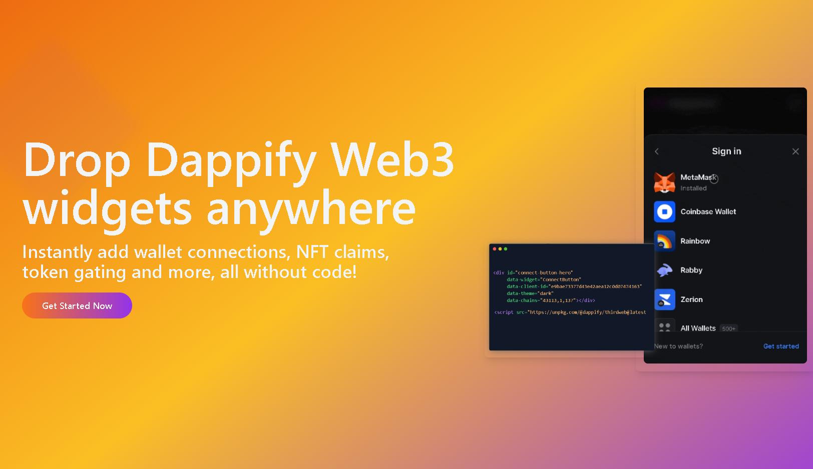

[](https://dappify-web3.github.io/widgets/badges.svg)
[](https://www.npmjs.com/package/@dappify/thirdweb)

Welcome to **[Dappify](https://github.com)**, a library for seamlessly integrating Web3 functionality into any webpage. Powered by Thirdweb, Dappify provides drop-in widgets like ConnectButton and ClaimButton to connect wallets, claim NFTs, and more—all with minimal setup and maximum flexibility and without having to write code.

## Why Dappify?

- **Plug & Play**: Add Web3 widgets anywhere on your page with a single `<div>` and a script tag—no complex setup required.
- **Interconnected**: All widgets share a single `ThirdwebProvider` instance, ensuring wallet state (e.g., connected accounts) syncs across your site.
- **Non-Invasive**: Embeds widgets without overwriting your existing HTML, CSS, or JavaScript content.
- **Customizable**: Tailor themes, chains, and other properties via simple `data-*` attributes.

Whether you’re building a landing page, a dApp, or just experimenting with Web3, Dappify makes it effortless to bring blockchain interactions to your users.

## Installation

Get started with Dappify in just a few steps! Before using the widgets, you’ll need to set up your Thirdweb project, including a Client ID and any necessary smart contracts or configurations. You can then add Dappify to your page via CDN or a local build.

### Prerequisites
To use Dappify effectively, you’ll need:

- **Thirdweb Client ID**: Required for all widgets to authenticate with Thirdweb services. You must [create a project](https://thirdweb.com/dashboard) on the Thirdweb dashboard:
  1. Sign up or log in to [Thirdweb](https://thirdweb.com/).
  2. Go to the [Dashboard](https://thirdweb.com/dashboard) and click "Create New Project".
  3. Follow the prompts to generate a Client ID (e.g., `e9bae73377d43e42aea12c0d07474163`). Copy this ID for your widget attributes.
  - See the [Thirdweb Docs on Client IDs](https://portal.thirdweb.com/references/client-id) for more details.

- **Smart Contract Setup**: For widgets like `ClaimButton`, you need a deployed smart contract (e.g., an ERC721 NFT contract). Configure this in the Thirdweb dashboard:
  1. Navigate to [Contracts](https://thirdweb.com/dashboard/contracts) in the dashboard.
  2. Deploy a contract (e.g., NFT Drop) or import an existing one (e.g., `0xeF155b056299Ba3e98987f37a2CB5518DE0a98F3`).
  3. Note the contract address and chain (e.g., `43113` for Avalanche Fuji).
  - Check out the [Thirdweb Contract Deployment Tutorial](https://portal.thirdweb.com/guides/deploy-smart-contract) for a step-by-step guide.

- **Supported Chains**: Define blockchain chains in your widget attributes (e.g., `43113` for Avalanche Fuji, `1` for Ethereum Mainnet, `137` for Polygon). Ensure these match your Thirdweb project’s supported networks.

### Import Library Via CDN
The quickest way to use Dappify is by including the script from unpkg. Add this `<script>` tag just before the closing `</body>` tag in your HTML:

```html
<script src="https://unpkg.com/@dappify/thirdweb@0.1.0/dist/widgets.js"></script>
```

### Adding Widgets

Insert widget placeholders using `<div>` tags with the data-widget attribute. Configure their functionality with data-* attributes tailored to your needs.

#### ConnectButton Widget
Embed a `ConnectButton` to enable wallet connections
```
<div   id="wallet-connect"
       data-widget="ConnectButton"
       data-client-id="your-thirdweb-client-id"
       data-theme="dark"
       data-chains="43113,1,137"
       class="inline-block">
 </div>
```
- `data-widget="ConnectButton"`: Defines a wallet connection widget.
- `data-client-id`: Your unique Thirdweb Client ID (swap in your own).
- `data-theme`: Choose "dark" or "light" for the look.
- `data-chains`: List supported chain IDs (e.g., 43113 for Avalanche Fuji, 1 for Ethereum Mainnet, 137 for Polygon) comma separated.

#### NFT Claim Button Widget
Add a `ClaimButton` to allow users to claim NFTs from your contract
```
<div   id="nft-claim"
       data-widget="ClaimButton"
       data-client-id="your-thirdweb-client-id"
       data-chains="43113"
       data-contract-address="0xeF155b056299Ba3e98987f37a2CB5518DE0a98F3"
       data-type="ERC721"
       data-claim-quantity="1"
       class="inline-block">
</div>
```
- `data-widget="ClaimButton"`: Creates an NFT claim widget.
- `data-client-id`: Your unique Thirdweb Client ID (swap in your own).
- `data-contract-address`: Your NFT contract’s address on the blockchain.
- `data-type`: Token type, such as `ERC721` or `ERC1155`.
- `data-claim-quantity`: Number of NFTs to claim per action (e.g., "1").

### Example NFT Minting Landing Page Template
Here’s a full HTML snippet showcasing widgets
```
<!DOCTYPE html>
<html lang="en">
<head>
  <meta charset="UTF-8">
  <meta name="viewport" content="width=device-width, initial-scale=1.0">
  <title>Dappify Demo</title>
</head>
<body>
    <h1>Explore Web3 with Dappify</h1>
    <p>Start by connecting your wallet:</p>
    <div id="wallet-connect"
            data-widget="ConnectButton"
            data-client-id="your-thirdweb-client-id"
            data-theme="dark"
            data-chains="43113,1,137"
            class="inline-block">
    </div>
    <p>Then grab your NFT:</p>
    <div id="nft-claim"
            data-widget="ClaimButton"
            data-client-id="your-thirdweb-client-id"
            data-chains="43113"
            data-contract-address="your-contract-address"
            data-type="ERC721"
            data-claim-quantity="1"
            class="inline-block">
    </div>
  <script src="https://unpkg.com/@dappify/thirdweb@0.1.0/dist/widgets.js"></script>
</body>
</html>
```